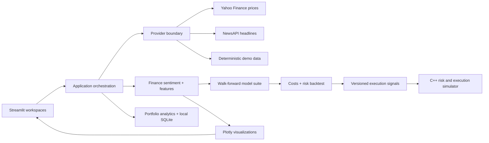

# SignalGlass


[](https://github.com/TarunT27/SignalGlass-Insights-Dashboard/actions/workflows/ci.yml)


SignalGlass is an explainable market-intelligence and strategy-research cockpit. It combines Yahoo Finance price history, finance-domain headline sentiment, chronological model comparison, cost-aware backtesting, portfolio-risk analysis, and a C++-ready execution-signal export in a polished Streamlit application.

The default experience is deterministic and works immediately. Switch to **Live** to load current Yahoo Finance prices without an API key. A NewsAPI key is optional; without one, the app keeps the live prices and clearly labels the accompanying headlines as demo data.

> Research prototype. Not financial advice.

## What makes it portfolio-ready

- **Apple-inspired product UI** — true-neutral graphite surfaces, cobalt interaction states, restrained glass, responsive layouts, and a focused information hierarchy.
- **Explainable evidence** — a 175-phrase finance lexicon scores every headline with negation handling and longest-phrase matching, and the exact matched phrases are printed under the headline. Demo and live headlines run through the same scorer, so the demo demonstrates the real engine.
- **Statistically honest results** — directional accuracy is reported with a Wilson 95% confidence interval and compared against the majority-direction baseline. A model that loses to the naive baseline is labelled *Below baseline* in red, and a lead that sits inside the runner-up's interval is called out as selection noise.
- **Five complete workspaces** — Overview, Compare, Intelligence, Portfolio, and Signals Lab are functional routes rather than decorative tabs.
- **Any Yahoo-compatible symbol** — type a stock, ETF, index, or crypto ticker directly into the searchable picker; recent symbols stay one click away, and company names resolve live for symbols outside the built-in map.
- **A real time-range control** — 1M/3M/6M/1Y changes how much history is fetched and evaluated, not just how much of a fixed window is drawn.
- **Measured data quality** — the headline percentage is computed from session coverage, field completeness, news coverage, and freshness, and the components are shown on hover.
- **No-key live prices** — Yahoo Finance data is accessed through `yfinance`; no Yahoo API key is required.
- **Honest model comparison** — linear regression, ridge regression, and random forest use identical expanding-window tests with no look-ahead, and the app states plainly when their results are indistinguishable.
- **Cost-aware backtesting** — signals include configurable transaction costs, thresholds, and long/cash or long/short rules, with Sharpe ratio, drawdown, turnover, and a buy-and-hold benchmark.
- **Portfolio risk** — a local SQLite workspace stores only watchlist symbols and allocations, then reports volatility, return, Sharpe ratio, drawdown, and asset risk contributions.
- **Research-to-execution handoff** — prediction-only JSON follows a versioned schema designed for integration with the companion C++ trading simulator; realized returns are deliberately excluded.
- **Resilient data provenance** — price and news sources are tracked independently, so a missing or failed news provider cannot silently mislabel the experience.
- **Traceable sources** — every headline links to its origin, with untrusted URLs filtered to http(s) before they reach the page.
- **Recruiter-friendly setup** — deterministic demo data, pinned dependencies, CI, linting, 133 automated tests, and 80% coverage enforcement.

## Product tour

| Workspace | Purpose |
| --- | --- |
| **Overview** | Price, volume, sentiment pulse, data quality, watchlist, and evidence for the latest move. |
| **Compare** | Normalized relative performance and a compact cross-company snapshot. |
| **Intelligence** | Auditable headline stream, tone distribution, source coverage, and a sourced market narrative. |
| **Portfolio** | Persistent research watchlist, allocation controls, cumulative return, drawdown, Sharpe ratio, and risk contributions. |
| **Signals Lab** | Model leaderboard, walk-forward predictions, cost-aware backtest, benchmark comparison, and execution-signal export. |

The picker starts with popular symbols such as AAPL, MSFT, NVDA, and TSLA, but accepts any validated Yahoo Finance-compatible ticker—for example AMD, SPY, BRK.B, `^GSPC`, or BTC-USD. The interface adapts from a dense desktop cockpit to a single-column mobile view.

## Quick start

SignalGlass requires Python 3.12 or newer.

```bash
git clone https://github.com/TarunT27/SignalGlass-Insights-Dashboard.git
cd SignalGlass-Insights-Dashboard
python -m venv .venv
```

Activate the environment and install dependencies:

```bash
# macOS / Linux
source .venv/bin/activate

# Windows PowerShell
.venv\Scripts\Activate.ps1

pip install -r requirements.txt
streamlit run app.py
```

Open [http://localhost:8501](http://localhost:8501). The app starts in Demo mode, so no credentials are needed.

Use the first control as a searchable ticker picker. Choose a suggested symbol or type a new one and press Enter. Shareable URLs can also seed a symbol, for example `?page=Overview&symbol=AMD`.

## Live data configuration

Yahoo Finance prices are keyless. To add live financial headlines, copy the example secrets file and provide a NewsAPI key:

```bash
cp .streamlit/secrets.toml.example .streamlit/secrets.toml
```

```toml
newsapi_key = "your-newsapi-key"
```

You can also set `NEWSAPI_KEY` in the environment. To make Live the initial selection, set:

```bash
SIGNALGLASS_DATA_MODE=live
```

If NewsAPI is unavailable, SignalGlass continues with live Yahoo prices plus clearly identified demo headlines. Secrets are never committed.

Portfolio preferences default to `.signalglass/signalglass.db`. Override the local path when needed:

```bash
SIGNALGLASS_DB_PATH=/path/to/signalglass.db
```

## Architecture



```text
app.py                    Application entry point and routing
signalglass/providers.py  Live/demo provider orchestration and provenance
signalglass/analytics.py  Sentiment aggregation, feature engineering, evaluation
signalglass/backtesting.py  Cost-aware signal simulation and risk metrics
signalglass/sentiment.py  Explainable finance-domain headline scoring
signalglass/portfolio.py  Multi-asset return and risk analysis
signalglass/store.py      Parameterized local SQLite preference storage
signalglass/signal_export.py  Versioned prediction-only execution handoff
signalglass/quality.py    Measured data-quality scoring for the loaded window
signalglass/windows.py    Shared 1M/3M/6M/1Y range definitions
signalglass/charts.py     Consistent Plotly chart builders
signalglass/theme.py      Design tokens and responsive Streamlit styling
signalglass/ui/           Feature-focused workspace renderers
tests/                    Unit and integration-style app tests
```

External data is normalized at the provider boundary. UI modules consume a stable `MarketBundle`, while analytics operate on validated pandas data frames. This keeps demo, partial-live, and fully live modes predictable.

## Quality gates

```bash
pip install --require-hashes -r requirements-lock.txt
python -m ruff check .
python -m ruff format --check .
python -m pytest --cov=signalglass --cov-report=term-missing --cov-fail-under=80
python -m pip_audit -r requirements-lock.txt
```

The current suite covers provider fallbacks, input validation, finance sentiment on naturally worded headlines, session alignment, model comparison, confidence intervals and baseline verdicts, transaction-cost accounting, portfolio risk, SQLite persistence, execution export, outbound-link safety, responsive-shell invariants, charts, and full app journeys. GitHub Actions runs lint, coverage, and dependency-audit checks for every push and pull request.

## Research-to-execution contract

Signals Lab exports `signalglass.execution.v1` JSON for the companion [C++ electronic-trading simulator](https://github.com/TarunT27/cpp-electronic-trading-simulator). Each record contains only information available when the decision is made:

```json
{
  "schema_version": "signalglass.execution.v1",
  "signals": [
    {
      "action": "BUY",
      "date": "2026-07-17",
      "model": "ridge",
      "score": 0.0042,
      "symbol": "AAPL"
    }
  ]
}
```

The machine-readable contract is in `schemas/signalglass.execution.v1.schema.json`. Realized returns are excluded to prevent downstream leakage.

## Design assets

The repository includes the visual exploration used to guide the implementation:

- `assets/concepts/signalglass-overview-desktop.png`
- `assets/concepts/signalglass-overview-mobile.png`
- `assets/concepts/signalglass-signals-lab.png`
- `assets/brand/signalglass-app-icon.png`

## Data and modeling notes

- Yahoo Finance access is provided through `yfinance` and is intended for personal, research, and educational use subject to the upstream terms.
- Demo prices and headlines are synthetic and labeled in the product.
- Headline sentiment uses an explainable finance phrase model, not a claim that an article or security is objectively positive or negative.
- Every model uses expanding-window, out-of-sample evaluation. Model selection uses the same test windows it reports, which biases the winner's accuracy upward; the app says so on screen rather than hiding it.
- Directional accuracy over 60–90 sessions has a confidence interval roughly ±11 points wide. Treat any single-run figure near 50% as noise — that is what the *Not significant* verdict means.
- Backtests include explicit frictions but remain simulations. Historical performance does not imply future results.
- The portfolio database stores research preferences only and is not connected to a brokerage account.

## Responsible use

SignalGlass is an engineering and product-design demonstration. It is not investment advice, does not execute trades, and should not be used as the sole basis for financial decisions.
